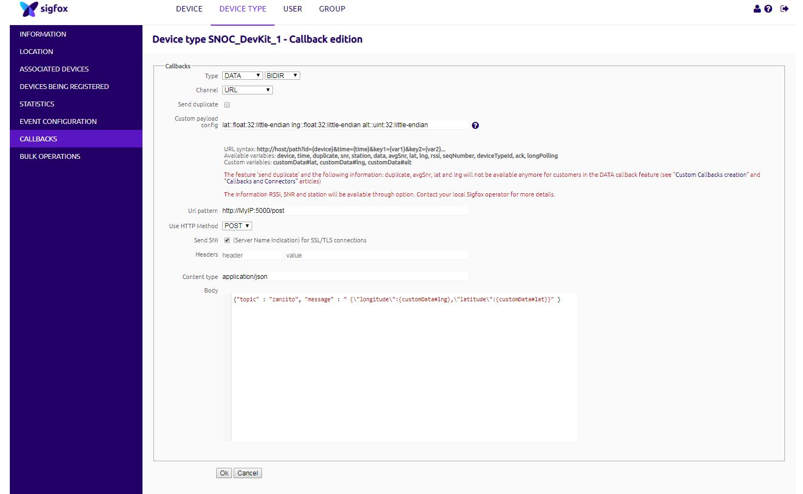

# ESP-SIGFOX
ESP8266 and SIGFOX module [Wisol SFM10R1](https://yadom.fr/carte-breakout-sfm10r1.html) integration

## Framework used: Arduino

pio lib dependancy: PubSubClient_ID89 c99-sigfox-wisol-WSSFM10R1AT_ID1893

## IDE used:
[PlatformIO Core](https://docs.platformio.org/en/latest/quickstart.html)

Use platform = espressif8266@2.3.0 due to issue with the latest version.

On my side, I use MQTT message in order to manage GPS data sent by the Sigfox Module.

Depending on the Sigfox Backend configuration which uses GET or POST methods, I set a http2Mqtt bridge which is listening on port 5000 via my IP  (thanks to https://github.com/petkov/http_to_mqtt)

Here my Sigfox callback configuration :

